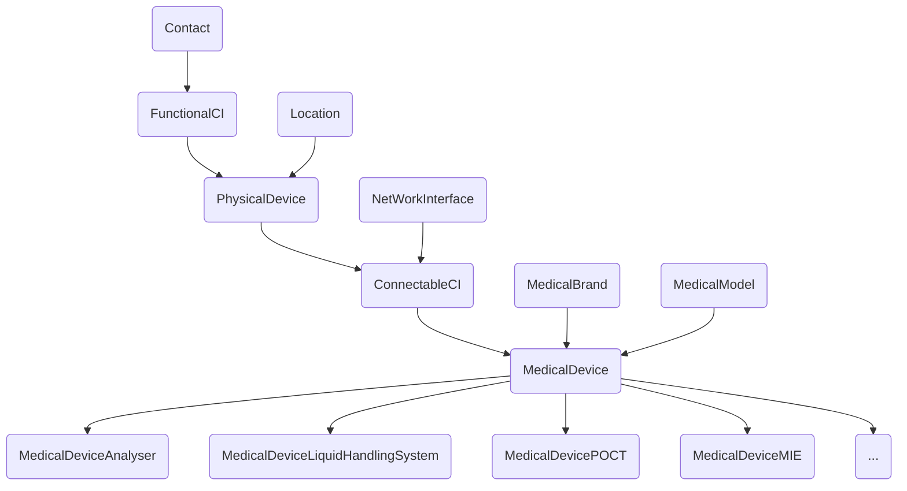

# iTop-br-medicaldevice

Copyright (c) 2024-2025 Björn Rudner

## What?

This extension adds structured management for **medical devices** in iTop. It introduces specific classes and attributes to support laboratory and clinical equipment, including model hierarchy and type classification.

### Core entities

- **MedicalBrand**: Manufacturer or brand (e.g. Siemens, Roche)
- **MedicalModel**: Model name and type (e.g. Centrifuge, Incubator, Analyser, Medical Imaging Equipment)
- **MedicalDevice**: Individual device instance with location, status, and technical identifiers

### Subclasses of `MedicalDevice`

- `MedicalDeviceAnalyser`
- `MedicalDeviceCentrifuge`
- `MedicalDeviceIncubator`
- `MedicalDeviceLiquidHandlingSystem`
- `MedicalDeviceMicroscope`
- `MedicalDeviceMIE`
- `MedicalDevicePOCT`
- `MedicalDeviceRefrigerator`
- `MedicalDeviceSafetyCabinet`
- `MedicalDeviceSamplePreparation`
- `MedicalDeviceTubeSorter`

Each subclass inherits from `ConnectableCI` and supports standard CMDB relationships (location, contracts, contacts, network interfaces, etc.).

## Features

- Separate typologies for **brand** and **model**
- Device-to-model relation
- Optional model filtering based on device class
- Full integration with iTop CMDB ecosystem
- Easy extension for additional device types (via XML)

## Relations

## Installation

Place this extension in the `extensions` folder of your iTop installation and run the setup again. Be sure to enable the extension during setup.

## Status

This extension is under active development. Feedback and contributions are welcome.

## iTop Compatibility

The branch [2.7](https://github.com/rudnerbjoern/iTop-br-medicaldevice/tree/itop/2.7) is compatible to iTop 2.7 and iTop 3.1.

The branch [main](https://github.com/rudnerbjoern/iTop-br-medicaldevice/tree/main) will only be compatible to iTop 3.1 and above.

Versions starting with 2.7.x are kept compatible to iTop 2.7

The extension was tested on iTop 2.7.10 and 3.2.1

## Attribution

This Extension uses Icons from:

 [Cardiogram Icon](https://iconscout.com/icons/cardiogram) by IconScout Store

 [Test-Tube Icon](https://iconscout.com/icons/test-tube) by HJ Project

 [Microscope Icon](https://iconscout.com/icons/microscope) by Rank Sol on IconScout

 [Blood-Test Icon](https://iconscout.com/icons/blood-test) by Surangkana Jomjunyong

 [Blood-Tube Icon](https://iconscout.com/icons/blood-tube) by M. Faisal

 [Sample-Preparation Icon](https://www.vecteezy.com/free-vector/container) by Vecteezy

 [Medical Icon](https://iconscout.com/icons/medical) by Jemis Mali

 [Freezer Icon](https://iconscout.com/icons/freezer) by Mohit Gandhi

 [Liquid Dropper Icon](https://iconscout.com/icons/liquid-dropper) by Rafiico Creative Studio

 [Biosafety Cabinet Icon](https://www.freepik.com/icon/biosafety-cabinet_9569504) by Freepik

 [CT Scanner Icon](https://iconscout.com/icons/ct-scan) by Pendimarfuad Adv
